<div align="center">

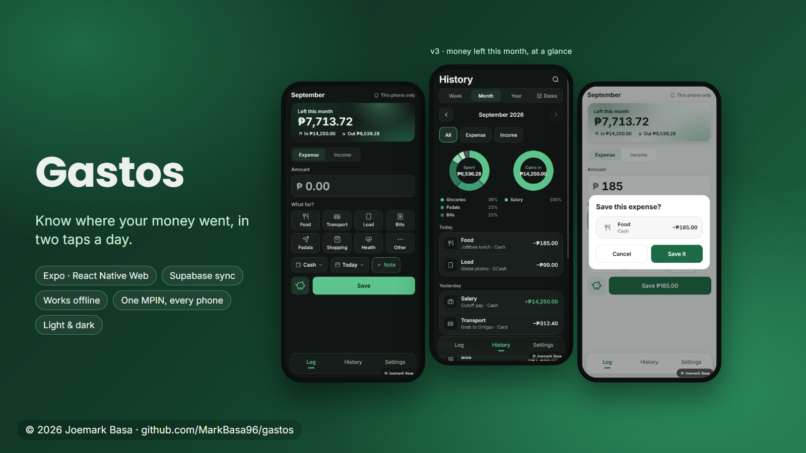

# Gastos

**Know where your money went, in two taps a day.**

A phone-first expense tracker built for how people in the Philippines actually pay:
cash, cards, GCash, Maya and digital banks. It opens and works offline, syncs when you're back
online, and locks with one 4-digit MPIN that works on all your phones.

**[Open the live app →](https://gastos-six-phi.vercel.app)** · **[Download for Android (APK) →](https://github.com/MarkBasa96/gastos/releases/latest/download/Gastos-3.0.0.apk)**

<sub>iPhone: open the live app in Safari → Share → Add to Home Screen.</sub>

</div>

---

## Why it exists

Gastos started as a favour for someone who had never tracked her spending. One rule decided
every design choice: **if logging is inconvenient, she won't keep it up.** So logging is amount,
one category tile, Save, done. The keyboard only opens when you tap the amount, "Paid with"
remembers your usual wallet, and Save sits right under your thumb.

## What's new in 3.1

- **Color themes.** Eight to pick from in Settings: Gastos green, Baby pink, Lavender, Ocean blue, Mint teal, Sunset coral, Sunflower and Latte. Light and dark both follow it, and when you're signed in it follows your account onto every phone.
- **FAQ in Settings.** Quick answers, searchable, that work offline: where entries are saved, how safe your data is, backups, the MPIN, and more.
- **Name your own "Other".** Tap Other and a pop-up asks what it was ("Haircut"). It saves under that name and, if you like, stays as a tile for next time.
- **A note you can't miss.** The note is now a full-width box above Save, and the save pop-up shows it on its own line.
- **Tap an entry in History to see everything about it** (amount, date, wallet, note, when it was added), with an Edit button at the top.
- **Pop-ups blur the screen behind them.**
- **The phone's Back button works again on Android.** 3.0's version was skipped by newer Chrome, so Back closed the app. 3.1 uses Chrome's built-in way to catch Back for pop-ups (CloseWatcher), with the old approach as a fallback.

## What's new in 3.0

- **Money left this month.** The top card shows income minus spending, with *In* and *Out* underneath. It counts up each time you open the tab.
- **A quicker Log screen.** Amount, what it was for, then Save, with wallet, date and note as small chips above it. No keyboard popping up on its own.
- **A piggy bank beside Save.** The coin drops in with a clink when you save. Tap the pig for a shower of gold coins.
- **Check before it happens.** A short Save / Delete / Sign out confirmation shows exactly what's about to change.
- **History that answers questions.** Pick any date range, filter All / Expense / Income, and the chart follows: spending, income, or both rings side by side. The list shows a screenful, then *See more*.
- **One MPIN for all your phones.** Set it once; a new phone asks for the same one. Turning it off or changing it asks for the current MPIN first.
- **Works offline from a cold start.** The app keeps a copy of itself on the phone, so it opens and logs with no signal and syncs later.
- **The phone's Back button works like you'd expect.** It closes the open sheet or pop-up (never saving or deleting anything), goes from History or Settings back to Log, and on Log asks before closing the app.
- **Edit your cards and e-wallets,** send feedback from Settings, a smaller loading screen with skeletons, sounds you can switch off, tap feedback on every button, and a circular light/dark switch.

## Features

- **Log an expense or income in seconds.** Filipino-first categories: Food, Transport, Load, Bills, *Padala*, Shopping, Health, plus your own.
- **Paid with:** cash, cards, e-wallets and digital banks (GCash, Maya, GoTyme, SeaBank…). Names only, never account numbers. Rename or remove them any time.
- **History:** week, month, year or any dates you pick; spending and income charts; entries grouped by day; search. Tap an entry to see all its details, with Edit at the top.
- **Offline-first sync:** every save lands on the phone first, then syncs. A small status dot shows *Synced / Saving / Offline / N waiting*.
- **MPIN lock:** asked when the app opens fresh or after 30 minutes away, not every time you switch apps.
- **Currency conversion** at today's rate. The original amounts are always kept, so switching back is exact.
- **Light, dark or automatic,** installs to the home screen like an app, and an Android app on the Releases page.
- **Backup and restore** to a file, with a safe "add what's missing" merge.
- **Feedback from Settings** goes straight to the developer.

## Screenshots

| Log | Log (dark) | Before saving | Tap the pig |
|---|---|---|---|
| 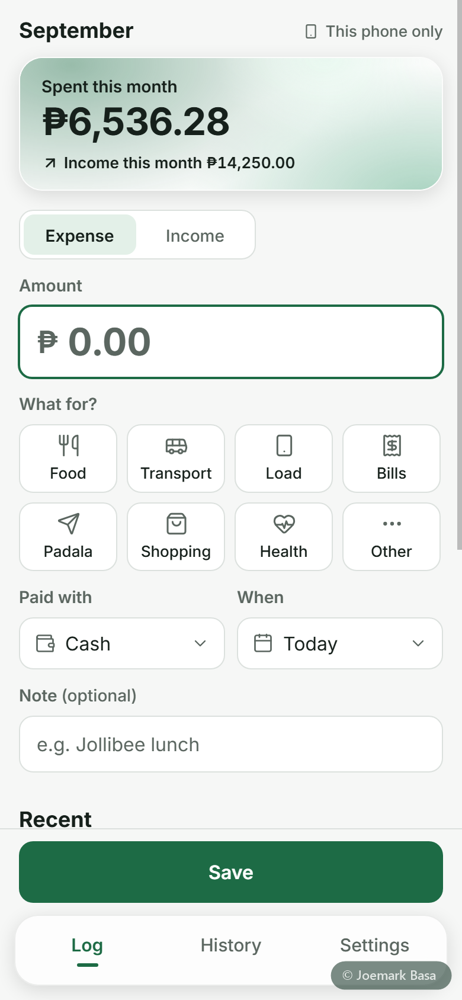 | 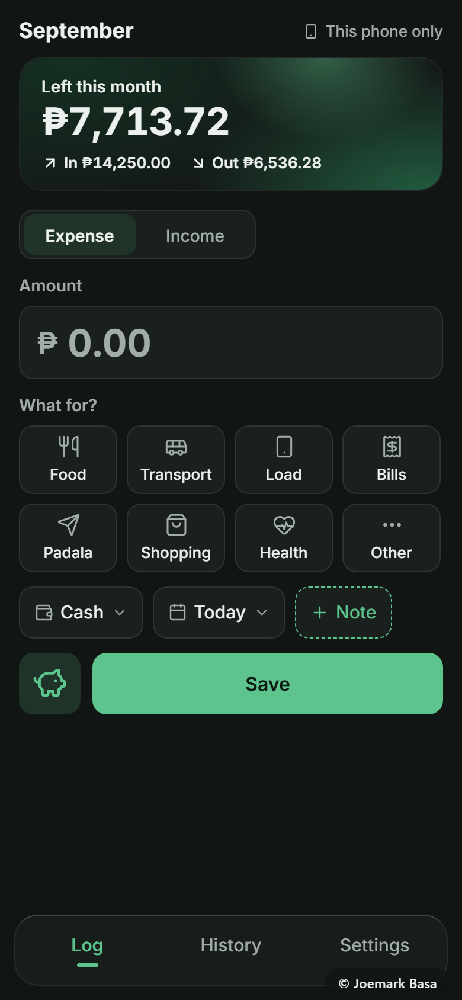 | 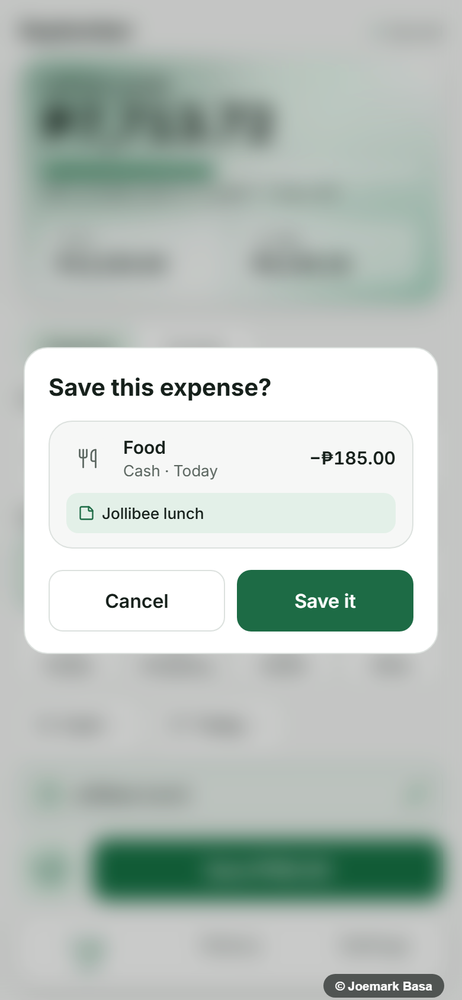 | 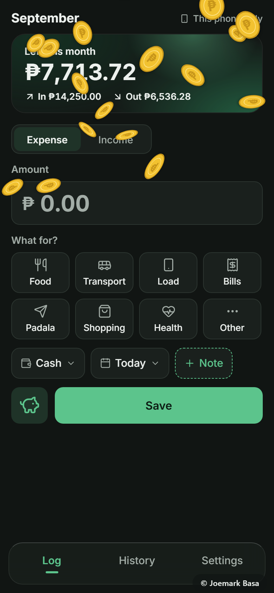 |

| History | Pick dates | Two taps to edit | Edit |
|---|---|---|---|
| 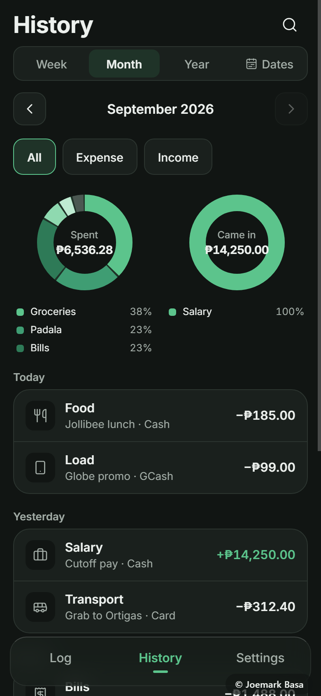 | 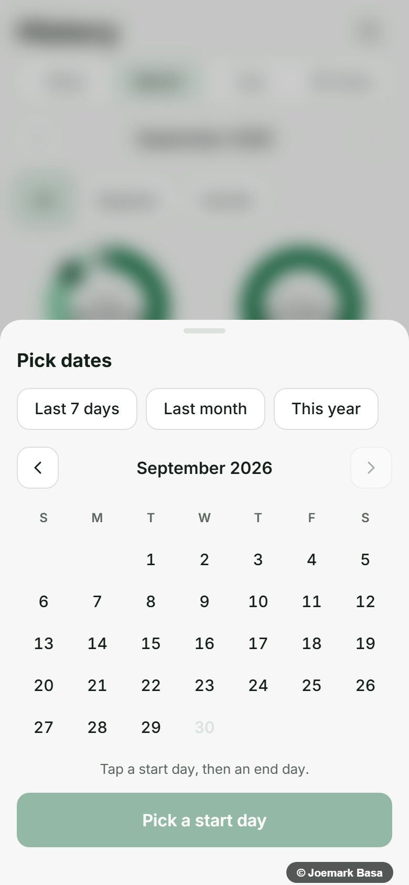 | 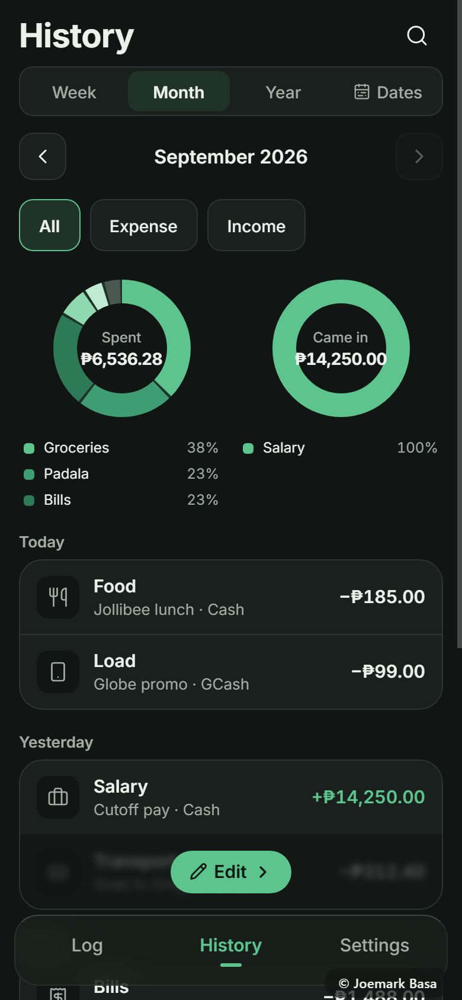 | 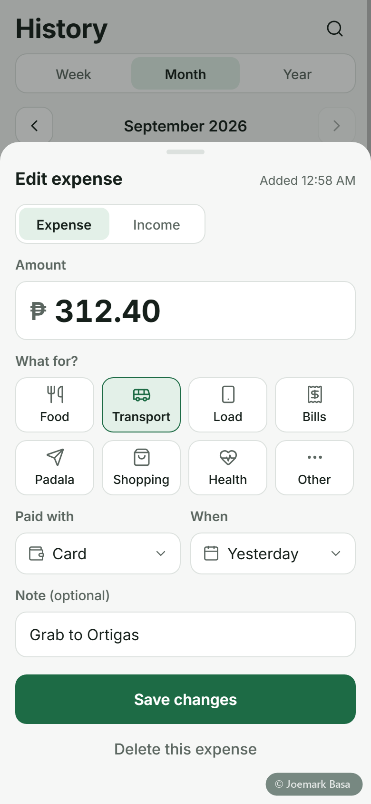 |

| Settings | Cards and e-wallets | MPIN | MPIN keypad |
|---|---|---|---|
| 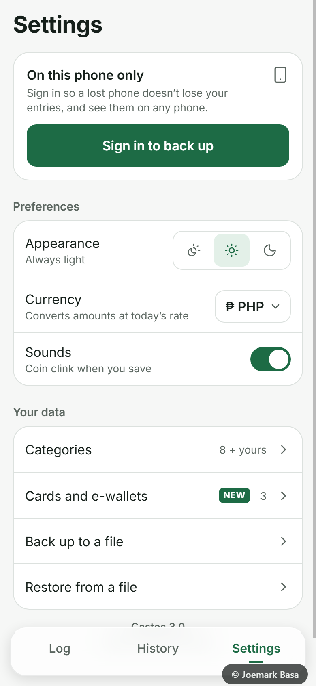 | 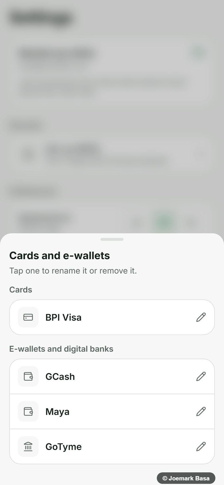 | 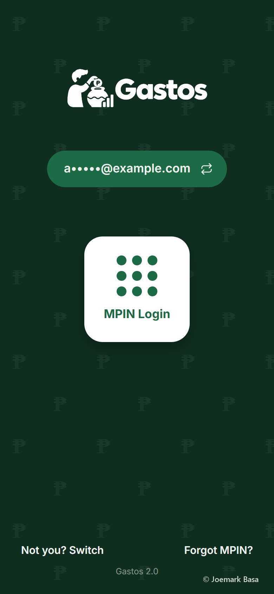 | 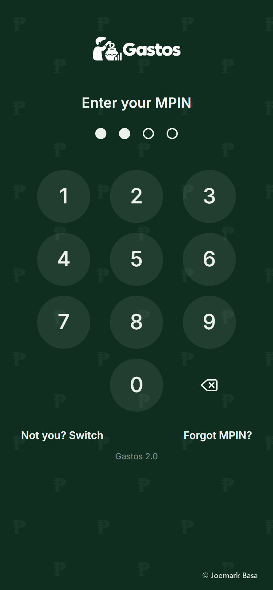 |

<sub>Screenshots use sample data.</sub>

## How it was built

The design process came before the code, and every version goes through the same loop:

1. **Research.** A sourced study of mobile UI rules (UX laws, button states, login and OTP
   patterns, dark-mode pitfalls, colour, accessibility) and of how well-regarded trackers work.
2. **Mockups first.** Still phone-size mockups in both themes, reviewed and approved before any
   code was written. Version 3 went through three rounds of mockups.
3. **Security design before the build.** The shared MPIN, the feedback email and offline mode were
   designed with a security review before the first line of code, then audited again after.
4. **Build and test.** Expo and React Native Web on a Supabase backend. An automated tap-through
   test in a phone-size browser checks exact values (one tap = one saved row, the right total),
   including an offline cold start and database tests that run against the real server and roll back.
5. **Real-phone rounds.** Two rounds on an Android phone and an iPhone before going live.

## Tech stack

| | |
|---|---|
| App | [Expo](https://expo.dev) (SDK 57), React Native, React Native Web, TypeScript |
| Backend | [Supabase](https://supabase.com): Postgres with Row Level Security, email one-time-code sign-in, Vault |
| UI | Hand-built components, [Lucide](https://lucide.dev) icons, `react-native-svg`, Inter and Poppins, sounds synthesised with Web Audio (no audio files) |
| Offline | A small service worker that caches only the app's own files, one set per build |
| Exchange rates | [Frankfurter](https://frankfurter.dev) (ECB and central-bank data), with [open.er-api.com](https://open.er-api.com) as fallback |
| Email | [Brevo](https://www.brevo.com) for sign-in codes and feedback |
| Hosting | Vercel (static web export, installable PWA); Android app as a Trusted Web Activity |

## Security notes

- **Row Level Security** on every table: each account can only read and write its own rows (`supabase/schema.sql`, tests in `supabase/rls-test.sql` and `supabase/test-v3.sql`).
- **Database constraints back the app's validation.** For example, a "Paid with" value that looks like a card number is rejected.
- **The account MPIN is kept where the app can't read it.** It lives in a private schema with no API access, hashed with an HMAC keyed by a secret in Supabase Vault and then bcrypt. It's only checked through database functions that work on the signed-in account alone and never return the hash. Wrong tries are counted on the server, **5 across all phones**, then an email code is required; the functions can't be rolled back or raced to get more guesses. Changing or turning off the MPIN checks the current one in the same call. A forgotten MPIN is reset only with a fresh email code.
- **Offline unlock** uses a PBKDF2 copy on each phone (100k iterations, random salt). It's replaced whenever the MPIN changes on another phone and needs an online check at least every 30 days.
- **What the MPIN is and isn't:** a lock on the app for a phone that's already unlocked. It keeps casual eyes out. Anyone who controls the account's email can reset it, and it's no substitute for the phone's own lock.
- **Feedback** goes through one database function: limited per account and per day, stored as plain text, emailed to a fixed address with a key that never leaves the database.
- **The service worker never caches API traffic,** sign-in, or anything with a query string: only the app's own files.
- **Bot check on sign-in:** Cloudflare Turnstile, enforced by Supabase Auth on "send me a code".
- **Merge-restore is insert-only,** so an old backup can never overwrite newer data or bring deleted entries back.

## Run it yourself

```bash
npm install
cp .env.example .env.local        # add your Supabase project URL and publishable key
npx expo start --web
```

Set up the database by running, in the Supabase SQL editor: `supabase/schema.sql`, then
`supabase/migration-v2.sql`, then `supabase/migration-v3.sql` (it creates its own MPIN secret in
Vault), then `supabase/migration-v3.1.sql` (the color theme on the settings row). Feedback emails are optional: add a Brevo API key to Vault as `gastos_brevo_feedback_key`
and change the addresses in `send_feedback`. Without a key, feedback is still saved.

For a web build, run `npx expo export -p web` and then `node scripts/write-sw.mjs dist`, which
writes the offline file list for that build. The app also works with no backend at all (it stays on
the phone only).

## Licence

MIT © 2026 Joemark Basa
