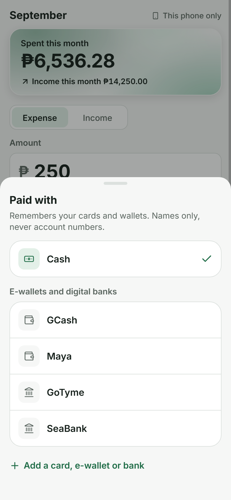
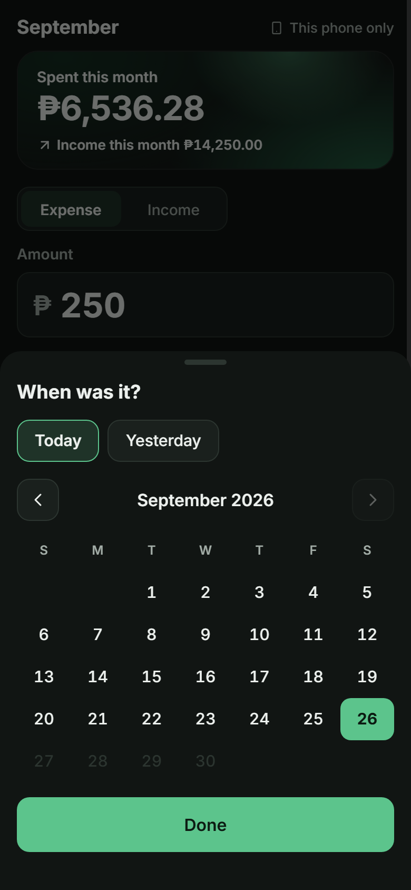
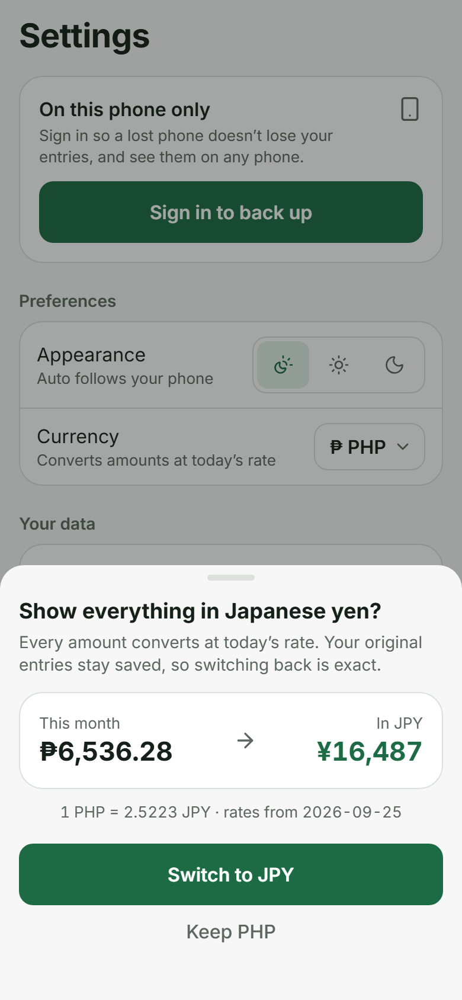
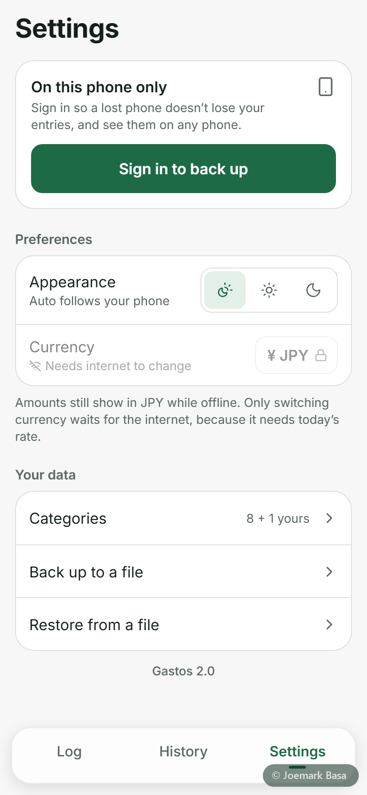
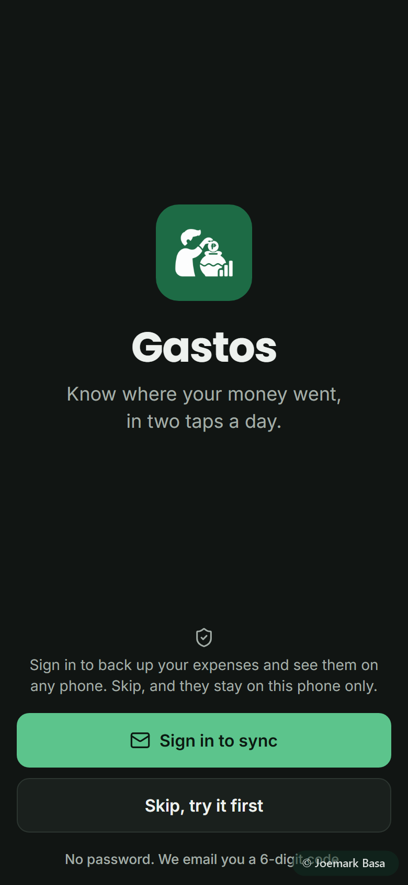

<div align="center">


# Gastos

**Know where your money went, in two taps a day.**

A phone-first expense tracker built for how people in the Philippines actually pay:
cash, cards, GCash, Maya and digital banks. It works offline, syncs when you're back online,
and locks with a 4-digit MPIN.

**[Open the live app →](https://gastos-six-phi.vercel.app)**

</div>

---

## Why it exists

Gastos started as a favour for someone who had never tracked her spending. One rule decided
every design choice: **if logging is inconvenient, she won't keep it up.** So the amount field
opens first, the categories are big icon tiles, "Paid with" remembers your usual wallet, and
Save sits within thumb reach.

## Features

- **Log an expense or income in seconds.** Amount, a category tile, done. Date and wallet default sensibly.
- **Filipino-first categories:** Food, Transport, Load, Bills, *Padala*, Shopping, Health, plus your own.
- **Paid with:** cash, cards, e-wallets and digital banks (GCash, Maya, GoTyme, SeaBank…). Names only, never account numbers.
- **History:** week, month or year, a spending donut with the total in the centre, entries grouped by day, and search.
- **Edit and delete** any entry, with an undo right after saving.
- **Offline-first sync:** every save lands on the phone first, then syncs to the cloud automatically. A small status dot shows *Synced / Saving / Offline / N waiting*.
- **MPIN lock:** optional 4-digit PIN, asked every time the app opens.
- **Currency conversion** at today's rate. The original amounts are always kept, so switching back is exact.
- **Light, dark or automatic** appearance, and it installs to the home screen like an app.
- **Backup and restore** to a file, with a safe "add what's missing" merge.

## Screenshots

| Log | History | Paid with | Calendar |
|---|---|---|---|
|  |  |  |  |

| Edit | Currency | Offline settings | Welcome |
|---|---|---|---|
|  |  |  |  |

<sub>Screenshots use sample data.</sub>

## How it was built

The design process came before the code:

1. **Research.** A sourced study of mobile UI rules (UX laws, button states, login and OTP
   patterns, dark-mode pitfalls, colour, accessibility) and of how well-regarded trackers work.
2. **Design direction and mockups.** Still phone-size mockups in both themes, reviewed and
   revised before any code was written.
3. **Build.** Expo and React Native Web, a Supabase backend with Row Level Security.
4. **Review.** A design review against the approved mockups, a security audit of the lock, sync
   and restore code, and an automated tap-through test in a phone-size browser.

## Tech stack

| | |
|---|---|
| App | [Expo](https://expo.dev) (SDK 57), React Native, React Native Web, TypeScript |
| Backend | [Supabase](https://supabase.com): Postgres with Row Level Security, email one-time-code sign-in |
| UI | Hand-built components, [Lucide](https://lucide.dev) icons, `react-native-svg` (donut and glass card), Inter and Poppins |
| Exchange rates | [Frankfurter](https://frankfurter.dev) (ECB and central-bank data), with [open.er-api.com](https://open.er-api.com) as fallback |
| Hosting | Vercel (static web export, installable PWA) |

## Security notes

- **Row Level Security** on every table: each account can only read and write its own rows (`supabase/schema.sql`, with tests in `supabase/rls-test.sql`).
- **Database constraints back the app's validation on every expense row.** For example, a "Paid with" value that looks like a card number is rejected.
- **MPIN** is hashed with PBKDF2-SHA-256 (100k iterations, random salt) through WebCrypto. Guesses are counted *before* they're checked, the app locks whenever it goes to the background, and 5 wrong tries require an email code. On the web it's an app lock for a phone that's already unlocked: it keeps casual eyes out, but someone with browser developer tools can get past it. It's not a replacement for the phone's own lock.
- **Bot check on sign-in:** Cloudflare Turnstile, enforced by Supabase Auth on "send me a code", so bots can't burn the email quota. Staying signed in and entering the code are unaffected.
- **Merge-restore is insert-only**, so an old backup can never overwrite newer data or bring deleted entries back.

## Run it yourself

```bash
npm install
cp .env.example .env.local        # add your Supabase project URL and publishable key
npx expo start --web
```

Set up the database by running `supabase/schema.sql`, then `supabase/migration-v2.sql`, in the Supabase SQL editor.
The app also works with no backend at all (it stays on the phone only).

## Licence

MIT © 2026 Joemark Basa
